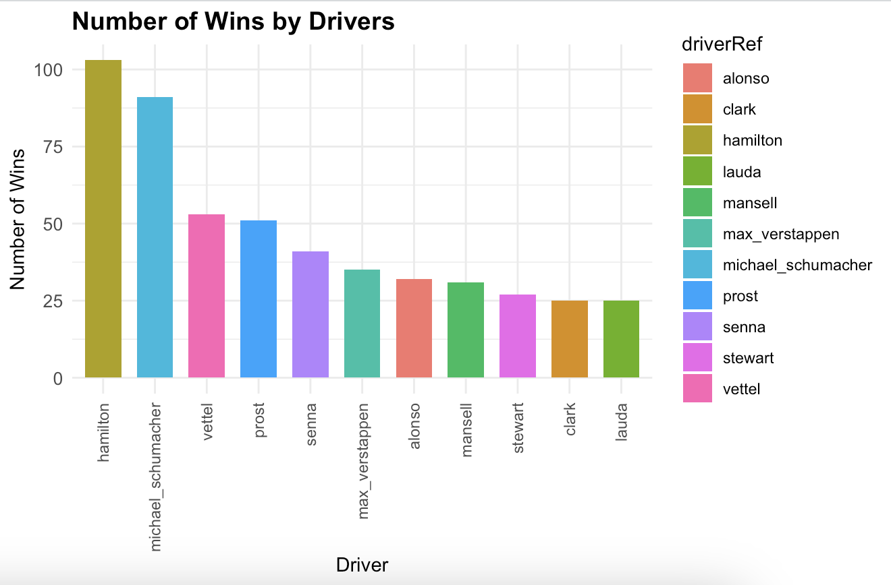
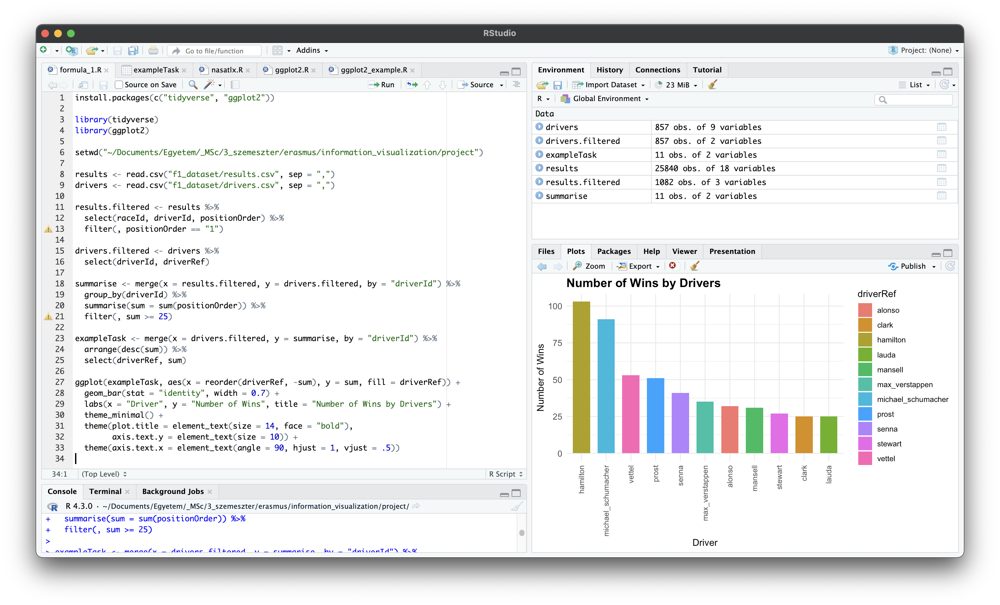
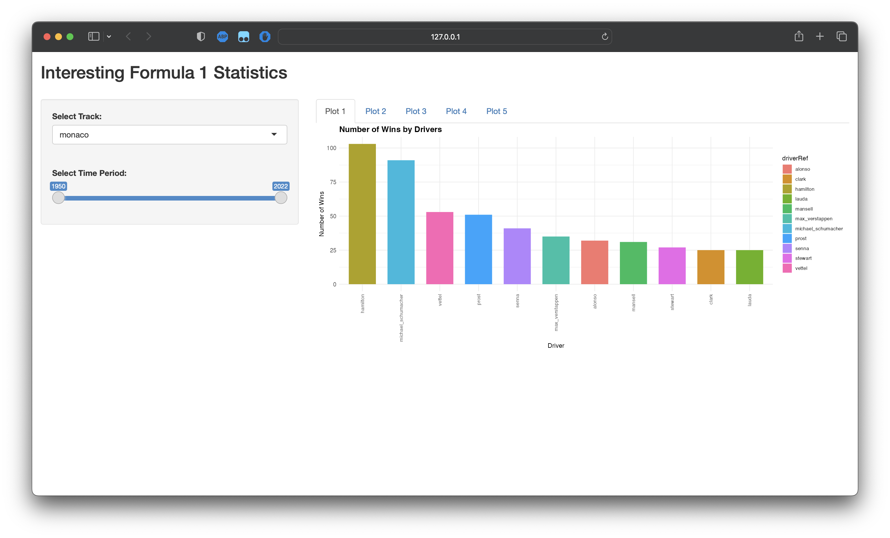
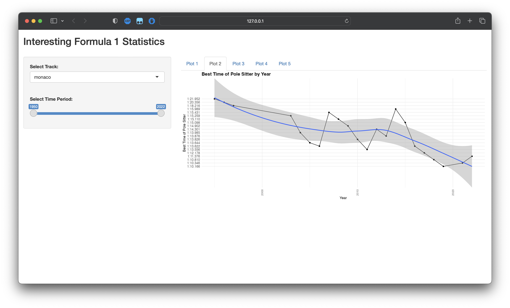
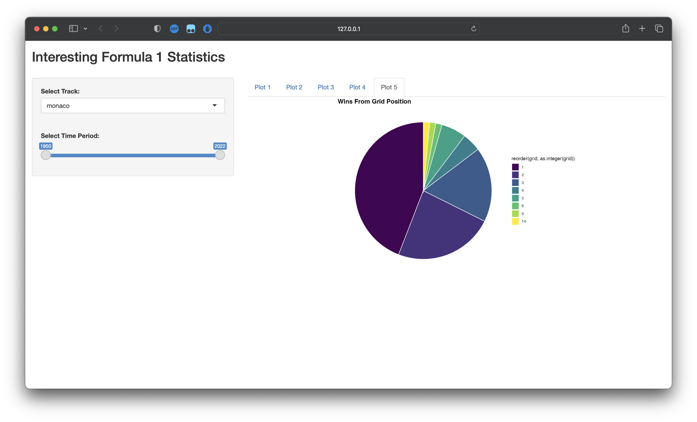
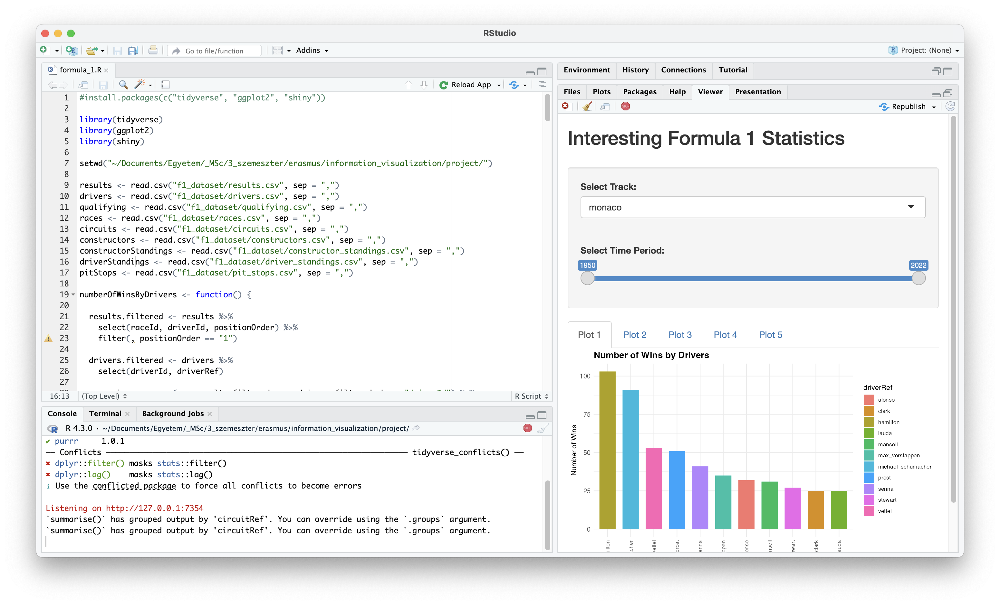

# Selected Topics in Information Visualization - Project

## Interesting Formula 1 Statistics
## Made by: Máté Vass (76220125)
## GitHub repository: <a href="https://github.com/material1999/f1-visualization">Check out the repository!</a>
## Deployed version: <a href="https://material1999.shinyapps.io/project/">Check out the application!</a>
## Demo Video: TODO

---

 

## Description

Formula 1 is the highest class international open-wheel single-seater formula racing series in the world, with hundreds of millions of followers worldwide. Every year, unbelievably large amounts of money is spent by the constructors to develop the fastest car possible in order to attract wealthy sponsors and create great advertisement for the brand itself. Winning a season in Formula 1 is considered to be the highest achievement in the world of motorsports. Following the sport is very easy due to its popularity. However, only a few tools are publicly available for free to analyze results and statistics at a deeper level.
I found a dataset on Kaggle representing Formula 1 results, statistics and metadata from the first season in 1950 until this year, 2023. I follow a few social media pages that showcase some really interesting facts and statistics about F1 race after race. I was partially inspired by them, and I think it would be very exciting to create various visualizations from the dataset mentioned above and provide a free tool for the hardcore fans.

## Dataset

<figure>
  
  <figcaption style="text-align: center;"><a href="https://www.kaggle.com/datasets/rohanrao/formula-1-world-championship-1950-2020">Check out the dataset!</a></figcaption>
</figure>

## Tasks

In this section, I'm going to describe a few tasks that a user can perform using the visualization tool. These tasks are described using the "Why" dimension of Munzner's taxonomy.

- Explore: with different views, the users can explore various aspects of Formula 1. For example, they can get to know some important drivers and constructors that were dominant in certain periods of time in the past years.

- Browse: after acquiring some basic knowledge, users can browse the dataset intentionally based on some attributes. In some views, for example, they can set certain variable values and narrow down their query to the desired subset.

- Compare: some views provide the ability to compare two plots at the same time. For example, it might be interesting to see which tracks are usually won from the first row, or which are ones where qualifying grid position matters less.

- Discover: the users can verify their different hypothesises in some of the views. For example, they can see that as technology is evolving, qualifying lap times are getting lower in the sport. However, other factors such as rain during qualifying result in spikes in the decreasing lap time trends.

- Enjoy: sometimes the only goal of visualizing some data is just pure joy without any deeper understanding of the topic. For example, in the view with the driver wins in the history of Formula 1, the users have the ability to start an animation. It loops through every race from the beginnings of the sport, and shows the users how different drivers in certain eras dominated the sport.

- Locate & Lookup: for more hardcore fans, there is a possibility to look for and locate certain facts with the visualization tool. They can even specify their desired time periods and tracks in the views and look up the exact information they are interested in.

## Tools used

The visualization tool is going to be built using:

- working with data: R

- plots: ggplot2 & plotly

- interaction, UI: R Shiny & plotly

- web application: shinyapps.io

The application is deployed using *shinyapps.io*, for the purpose of the presentation and testing the trial with 25 hours of active time is enough.

## Views

In this section, there are short descriptions of the different views that the tool is going to support. In every one of the views, the user can modify the time period, this is one the temporal attribute in the application.

- View 1: Driver Wins

  In this view, there is a treemap showing the most successful drivers in the history of Formula 1 based on their number of wins. Besides the time period, users can specify the minimum and maximum number of wins. This way, they can specifically look at "equally successful" drivers based on the number of races won.

- Views 2 & 3: Driver & Constructor Championships

  These two views are kind of similar to the first one, but it is about driver and constructor championship titles. Another difference is that these are just a normal bar charts. There is the time period attribute, and also a minimum and maximum number of titles attribute. Here users can look at "equally succesful" drivers and constructors based on the number of titles won.

- View 4: Best Lap Times

  In this view, users can look at certain tracks and see how lap times have improved over the years. There is an ability to compare two different tracks, and look at the differences in characteristics. It can be interesting to think about the potential factors that lead to the results presented (such as unpredictable weather conditions, changes in the track layouts, etc).

- View 5: Wins From Grid Position

  This view gives the users two pie charts, where they can compare two different tracks as well. Here they can see information about from which grid positions is it most likely to win a race in the selected track based on the historical statistics. On most of the tracks, more than half of the wins came from pole position, but there are some exceptions that are really interesting.

## Interaction

As mentioned earlier, the users can interact with the plots:

- with the sidebar on the left, they can adjust their settings and the changes will appear instantly on the right side

- some plots use *plotly* that provides a few basic interaction options as well

- the *year* attribute can be adjusted for every plot

- for each plot, there are other specific attributes that the users can modify:

  - View 1: minimum and maximum wins

  - Views 2 & 3: minimum and maximum titles

  - Views 4 & 5: two tracks to compare

## Design explanations

In this section, I'm going to explain my decisions regarding the design rationale of the final application.

The application has a sidebar on the left, where users can adjust their settings for the actual plot. On the right side, there are different tabs to select between the available plots. The available settings on the left change dynamically based on which plot is selected. This UI layout is self-explanatory, in European countries we read from left to right, so we will not miss any important information.

I chose the same color theme for every plot, this template is suitable for visually compared people, for example who suffer from color blindness.

I used a tab layout in the main plot view, this way only one view is shown. This helps users focus only on one task at once.

The views are linked in a way that if they have the same modifiable attribute, the changes appear on all of them. For example, if we want to look at driver wins between 2000 and 2010, then when we switch to the driver championships tab, it will already display them between 2000 and 2010. It makes navigation between plots easier.

I tried to chose different types of chart for different purposes. With the treemap in View 1, users can easily see the differences between relatively big values. The bar plots in Views 2 and 3 are easily understandable and self-explanatory. With View 4 we can try to understand certain trends in lap times and compare them between different tracks. With View 5, I tried to showcase the different rates from where drivers have won grand prixs at different tracks.

In conclusion, I tried to make an application which is self-explanatory for the average user. However, it provides some options for those who really want to dig deep into some interesting aspects of Formula 1 and derive meaningful inferences from the provided statistics. The tasks described earlier can be easily performed by anyone, even those which are a little more complicated. The design principles for the whole application were chosen based on these goals.

## Prototypes

The development of the code can be tracked in the GitHub repository provided. Every prototype was made in R Studio before the final version was deployed with *shinyapps.io*.

### Prototype 1 - Test plot

To start off, I downloaded the dataset from Kaggle and made a very basic plot to see if everything is working and I can start doing more complex visualizations. This prototype was already presented in the last lecture. Here, everything was hardcoded, and the UI was still missing.

 

<figure>
  
  <figcaption style="text-align: center;">Prototype 1 - Plot</figcaption>
</figure>

 

<figure>
  
  <figcaption style="text-align: center;">Prototype 1 - Code</figcaption>
</figure>

### Prototype 2 - Test plot

In the second prototype, I created the base of the UI with some controls. However, these controls were still not functional. But for each tab, I added a different plot and the users could switch between them. This was the first interaction they could do with the visualizations.

<figure>
  
  <figcaption style="text-align: center;">Prototype 2 - Plot 1</figcaption>
</figure>

 

<figure>
  
  <figcaption style="text-align: center;">Prototype 2 - Plot 2</figcaption>
</figure>

<figure>
  
  <figcaption style="text-align: center;">Prototype 2 - Plot 5</figcaption>
</figure>

 

<figure>
  
  <figcaption style="text-align: center;">Prototype 2 - Code</figcaption>
</figure>

## Scenario

TODO