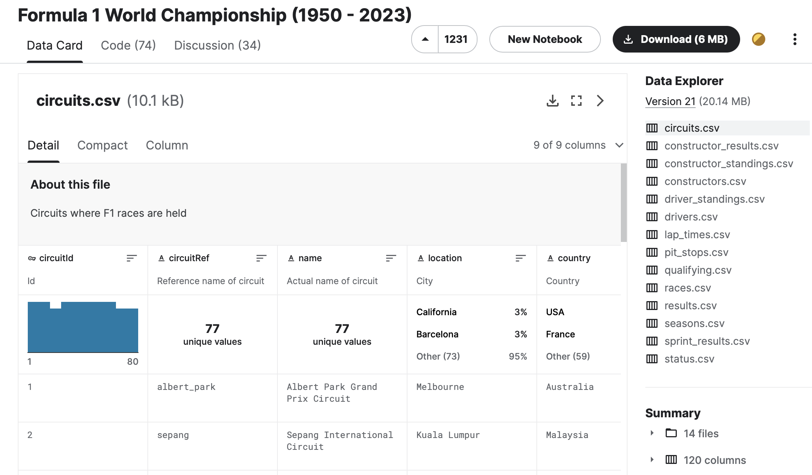

# Selected Topics in Information Visualization - Project

## Interesting Formula 1 Statistics
## Made by: Máté Vass (76220125)
## Demo Video: TODO

---

 

## Description

Formula 1 is the highest class international open-wheel single-seater formula racing series in the world, with hundreds of millions of followers worldwide. Every year, unbelievably large amounts of money is spent by the constructors to develop the fastest car possible in order to attract wealthy sponsors and create great advertisement for the brand itself. Winning a season in Formula 1 is considered to be the highest achievement in the world of motorsports. Following the sport is very easy due to its popularity. However, only a few tools are publicly available for free to analyze results and statistics at a deeper level.
I found a dataset on Kaggle representing Formula 1 results, statistics and metadata from the first season in 1950 until this year, 2023. I follow a few social media pages that showcase some really interesting facts and statistics about F1 race after race. I was partially inspired by them, and I think it would be very exciting to create various visualizations from the dataset mentioned above and provide a free tool for the hardcore fans.

## Dataset

<figure>
  
  <figcaption style="text-align: center;"><a href="https://www.kaggle.com/datasets/rohanrao/formula-1-world-championship-1950-2020">Check out the dataset!</a></figcaption>
</figure>

## Tasks

In this section, I'm going to describe a few tasks that a user can perform using the visualization tool. These tasks are described using the "Why" dimension of Munzner's taxonomy.

- Explore: with different views, the users can explore various aspects of Formula 1. For example, they can get to know some important drivers and constructors that were dominant in certain periods of time in the past years.

- Browse: after acquiring some basic knowledge, users can browse the dataset intentionally based on some attributes. In some views, for example, they can set certain variable values and narrow down their query to the desired subset.

- Compare: some views provide the ability to compare two plots at the same time. For example, it might be interesting to see which tracks are usually won from the first row, or which are ones where qualifying grid position matters less.

- Discover: the users can verify their different hypothesises in some of the views. For example, they can see that as technology is evolving, qualifying lap times are getting lower in the sport. However, other factors such as rain during qualifying result in spikes in the decreasing lap time trends.

- Enjoy: sometimes the only goal of visualizing some data is just pure joy without any deeper understanding of the topic. For example, in the view with the driver wins in the history of Formula 1, the users have the ability to start an animation. It loops through every race from the beginnings of the sport, and shows the users how different drivers in certain eras dominated the sport.

- Locate & Lookup: for more hardcore fans, there is a possibility to look for and locate certain facts with the visualization tool. They can even specify their desired time periods and tracks in the views and look up the exact information they are interested in.

## Design

The visualization tool is going to be built using:

- working with data: R

- plots: ggplot

- interaction, UI: R Shiny

- desktop/web application: TODO

TODO

## Views

In this section, there are short descriptions of the different views that the tool is going to support.

- 1: TODO

- 2: TODO

- 3: TODO

- 4: TODO

- 5: TODO

## Interaction

TODO